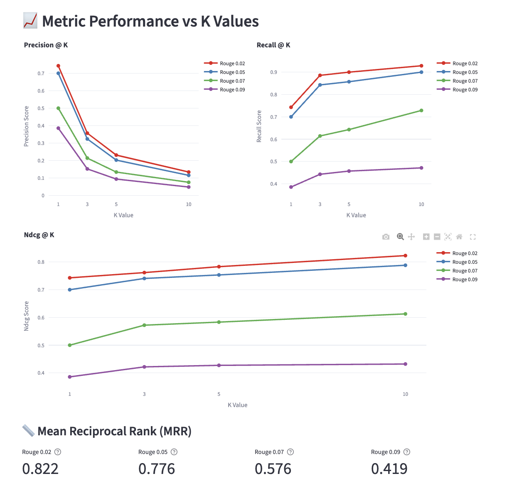
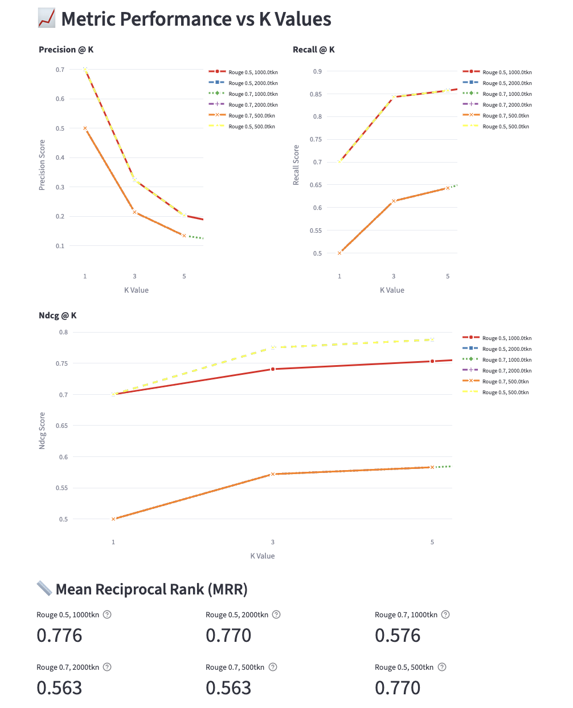

# Benchmark-1: Basic Chunking and Retrieving

## Setup
- Paragraph Chunking using "\n\n" as separator
- Basic Similarity Retrieval using OpenAI embeddings

## Results

## Analysis
- Even at basic level, K saturates at 3. Remove 10 for subsequent experiments, keep 5 just to be safe.
- Rouge-L (f-measure) = 0.5 is a good balance for the retrieval quality measure. it's okay to include some irrelevant chunks in the retrieval results (precision low, recall high), but not great to have too many mini-sized truncated chunks (precision high, recall low). From now on use 0.5 and 0.7 as rouge thresholds.
- Given the vector dim limit by Supabase (max. 2000), we can't test embedding model selection (text-embedding-3-large) given its dimension (3072).
- max_token didn't matter much, but 500-1000 yields similar results.