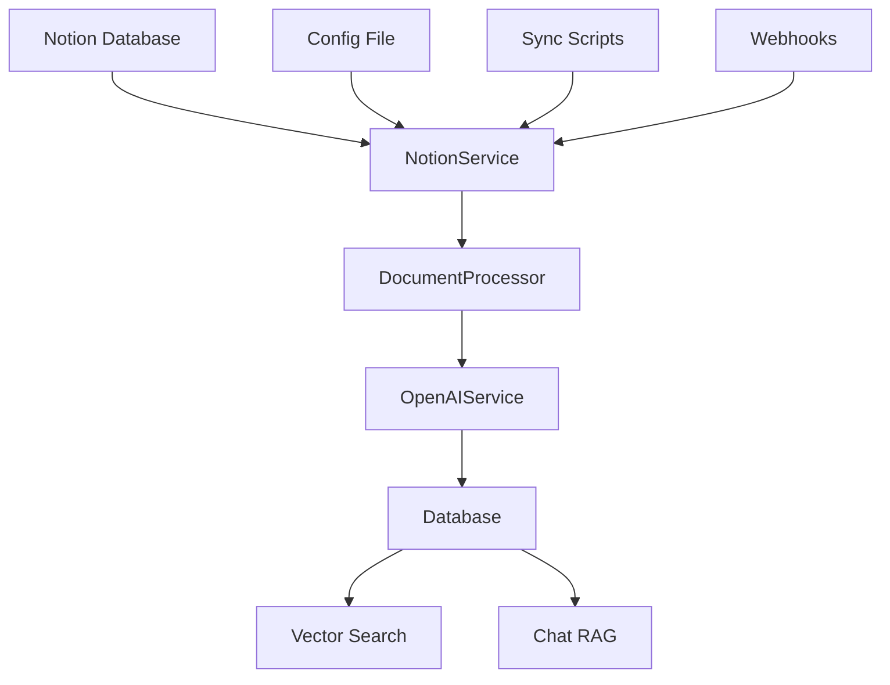

# Data Ingestion Pipeline - Technical Implementation

This document explains the technical architecture and implementation details of the Notion Companion data ingestion pipeline. For user-facing instructions and basic setup, see [NOTION_SYNC_USER_GUIDE.md](NOTION_SYNC_USER_GUIDE.md).

## 🏗️ Architecture Overview

The pipeline transforms Notion content into a searchable knowledge base with vector embeddings for AI-powered chat and search.



### Core Components

**Service Layer Architecture:**
- **NotionService** ([`services/notion_service.py`](../../backend/services/notion_service.py)) - Notion API integration with rate limiting
- **DocumentProcessor** ([`services/document_processor.py`](../../backend/services/document_processor.py)) - Content chunking and preprocessing  
- **OpenAIService** ([`services/openai_service.py`](../../backend/services/openai_service.py)) - Vector embedding generation
- **Database Layer** ([`database.py`](../../backend/database.py)) - PostgreSQL with pgvector storage

## 🔄 Sync Methods

> **Getting Started**: For basic usage, see [Quick Start](NOTION_SYNC_USER_GUIDE.md#quick-start) in the user guide.

### 1. Script-Based Sync (Primary)
- **Implementation**: Asyncio-based with configurable concurrency
- **Entry Point**: [`scripts/sync_databases.py`](../../backend/scripts/sync_databases.py)
- **Features**: Exponential backoff, intelligent retry logic, adaptive rate limiting

### 2. Frontend-Triggered Sync
- **Frontend Hook**: `useNotionConnection()` in [`hooks/use-notion-connection.ts`](../../hooks/use-notion-connection.ts)
- **API Endpoint**: `/api/notion/sync` in [`routers/notion_webhook.py`](../../backend/routers/notion_webhook.py)
- **Background Processing**: Task queue with status tracking

### 3. Webhook-Based Updates
- **Real-time Updates**: Notion webhook handler for live content changes
- **Event Types**: `page.updated`, `page.created`, `page.deleted`
- **Implementation**: [`routers/notion_webhook.py`](../../backend/routers/notion_webhook.py)

## ⚙️ Configuration Architecture

> **Basic Setup**: For essential settings, see [Basic Configuration](NOTION_SYNC_USER_GUIDE.md#basic-configuration) in the user guide.

### Configuration System
- **Main Config**: [`config/databases.toml`](../../backend/config/databases.toml) - Database definitions and sync settings
- **Model Config**: [`config/models.toml`](../../backend/config/models.toml) - AI model and embedding settings
- **Schema**: Advanced options include filtering, chunking strategies, performance tuning
- **Environment**: Secrets and deployment-specific settings via environment variables

Key configuration categories:
- **Sync Behavior**: Batch sizes, rate limiting, incremental vs full sync
- **Content Processing**: Chunking parameters, metadata extraction, filtering rules
- **Performance**: Concurrency limits, memory constraints, adaptive rate limiting
- **Embeddings**: Model selection, batch processing, token limits

## 📊 Sync Process Implementation

### Four-Phase Pipeline

**Phase 1: Database Registration**
- Schema discovery and field mapping
- Queryable field extraction for filtering
- Implementation: [`services/database_schema_manager.py`](../../backend/services/database_schema_manager.py)

**Phase 2: Intelligent Page Discovery**
- Incremental sync with timestamp comparison
- Advanced filtering and pagination handling
- Batch processing with adaptive rate limiting

**Phase 3: Content Processing Pipeline**
- Multi-step content extraction and validation
- Metadata extraction and property mapping
- Hash-based change detection for efficiency

**Phase 4: Vector Storage**
- Intelligent document chunking using [`services/contextual_chunker.py`](../../backend/services/contextual_chunker.py)
- Batch embedding generation with OpenAI API
- Optimized database storage with vector indexing

## 📈 Performance & Monitoring

### Real-time Metrics
- **API Performance**: Call frequency, response times, error rates
- **Embedding Efficiency**: Tokens per second, batch processing stats
- **Resource Usage**: Memory consumption, database connection pooling
- **Implementation**: Performance monitoring integrated throughout sync process

### Adaptive Optimization
- **Rate Limiting**: Automatic adjustment based on API response patterns
- **Batch Sizing**: Dynamic optimization based on content characteristics
- **Memory Management**: Streaming processing for large datasets
- **Error Recovery**: Intelligent retry with exponential backoff

## 🔧 Error Handling Strategy

### Multi-Level Recovery
- **API Errors**: Notion-specific error codes with targeted recovery strategies
- **Embedding Failures**: Graceful degradation with content preservation
- **Database Issues**: Transaction rollback and consistency maintenance
- **Implementation**: Comprehensive error handling in [`services/`](../../backend/services/) modules

### Health Monitoring
- **Automated Diagnostics**: Orphaned chunk detection, embedding quality checks
- **Self-Healing**: Automatic cleanup and repair operations
- **Alerting**: Performance degradation and failure notifications

## 🌍 Multilingual Processing

### Bilingual Content Support
- **Language Detection**: Chinese/English content composition analysis
- **Contextual Chunking**: Language-aware text segmentation
- **Search Optimization**: PostgreSQL full-text search with 'simple' configuration
- **Implementation**: [`services/content_type_detector.py`](../../backend/services/content_type_detector.py)

### Database Schema
```sql
-- Optimized for Chinese/English mixed content
CREATE INDEX documents_content_multilingual_idx ON documents 
USING gin(to_tsvector('simple', coalesce(title, '') || ' ' || coalesce(content, '')));
```

## 🚀 Production Considerations

### Deployment Architecture
- **Containerization**: Multi-stage Docker builds for optimal performance
- **CI/CD Integration**: Automated sync with GitHub Actions
- **Monitoring**: Comprehensive logging and performance tracking
- **Scaling**: Horizontal scaling with worker process management

### Security & Performance
- **Secret Management**: Environment-based configuration for sensitive data
- **Connection Pooling**: Optimized database connections with Supabase
- **Rate Limiting**: Respect for API limits with intelligent backoff
- **Memory Optimization**: Streaming processing and garbage collection

## 🔍 Debugging & Analysis

> **Common Issues**: For basic troubleshooting, see [Common Issues](NOTION_SYNC_USER_GUIDE.md#common-issues--solutions) in the user guide.

### Advanced Diagnostics
- **Performance Profiling**: cProfile integration for bottleneck identification
- **Memory Analysis**: tracemalloc for memory usage tracking
- **Database Health**: Automated consistency checks and repair operations
- **Custom Analytics**: Sync performance and data quality metrics

### Development Tools
- **Debug Scripts**: [`scripts/`](../../backend/scripts/) directory contains diagnostic utilities
- **Test Suites**: Comprehensive testing in [`tests/`](../../backend/tests/) directory
- **Manual Testing**: Individual component testing utilities

## 🔗 Integration Points

### Main Application Interface
After sync completion, content is immediately available through:
- **Vector Search**: Semantic search across all ingested content
- **RAG Chat**: AI-powered conversations with knowledge base context
- **Database Filtering**: Content filtering by source Notion database
- **Real-time Updates**: Frontend automatically reflects new content

### API Endpoints
- **Search**: [`routers/search.py`](../../backend/routers/search.py) - Vector and hybrid search
- **Chat**: [`routers/chat.py`](../../backend/routers/chat.py) - RAG-powered conversations
- **Sessions**: [`routers/chat_sessions.py`](../../backend/routers/chat_sessions.py) - Persistent chat management

This architecture creates a production-ready, scalable knowledge base with comprehensive multilingual support and intelligent content processing.