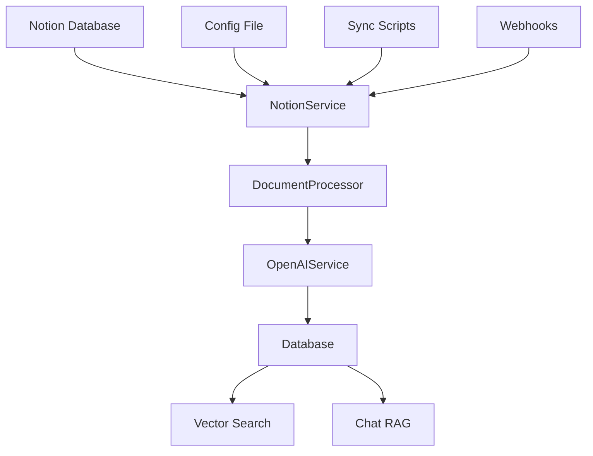

# Data Ingestion Pipeline - Technical Implementation

This document explains the technical architecture and implementation details of the Notion Companion data ingestion pipeline. For basic setup and usage, see [NOTION_SYNC_USER_GUIDE.md](NOTION_SYNC_USER_GUIDE.md).

## 🏗️ Architecture Overview

The pipeline transforms Notion content into a searchable knowledge base with vector embeddings for AI-powered chat and search.



### Core Components

**Service Layer Architecture:**
- **NotionService** ([`services/notion_service.py`](../../backend/services/notion_service.py)) - Notion API integration with rate limiting
- **DocumentProcessor** ([`services/document_processor.py`](../../backend/services/document_processor.py)) - Content chunking and preprocessing  
- **OpenAIService** ([`services/openai_service.py`](../../backend/services/openai_service.py)) - Vector embedding generation
- **Database Layer** ([`database.py`](../../backend/database.py)) - PostgreSQL with pgvector storage

## 🔄 Sync Methods

### 1. Script-Based Sync (Primary)
- **Implementation**: Asyncio-based with configurable concurrency
- **Entry Point**: [`scripts/sync_databases.py`](../../backend/scripts/sync_databases.py)
- **Features**: Exponential backoff, intelligent retry logic, adaptive rate limiting

### 2. Frontend-Triggered Sync
- **Frontend Hook**: `useNotionConnection()` in [`hooks/use-notion-connection.ts`](../../hooks/use-notion-connection.ts)
- **API Endpoint**: `/api/notion/sync` in [`routers/notion_webhook.py`](../../backend/routers/notion_webhook.py)
- **Background Processing**: Task queue with status tracking

### 3. Webhook-Based Updates
- **Real-time Updates**: Notion webhook handler for live content changes
- **Event Types**: `page.updated`, `page.created`, `page.deleted`
- **Implementation**: [`routers/notion_webhook.py`](../../backend/routers/notion_webhook.py)

## ⚙️ Advanced Configuration

### Configuration System Architecture
- **Main Config**: [`config/databases.toml`](../../backend/config/databases.toml) - Database definitions and sync settings
- **Model Config**: [`config/models.toml`](../../backend/config/models.toml) - AI model and embedding settings
- **Environment**: Secrets and deployment-specific settings via environment variables

### Advanced Database Configuration

```toml
[[databases]]
name = "Advanced Database"
database_id = "uuid-of-notion-database"
description = "Advanced configuration example"

[databases.sync_settings]
batch_size = 50                        # Pages per batch (1-100)
rate_limit_delay = 0.5                 # Seconds between batches (0.1-10.0)
max_retries = 5                        # Retry failed pages (1-10)
concurrent_pages = 3                   # Parallel page processing (1-10)
enable_incremental_sync = true         # Only sync changed pages
last_sync_timestamp = "2024-01-01T00:00:00Z"

[databases.content_processing]
chunk_size = 1000                      # Characters per chunk (500-2000)
chunk_overlap = 200                    # Character overlap (100-500)
enable_multilingual_processing = true  # Chinese/English optimization
content_type_detection = true          # Auto-detect article vs note type

[databases.filtering]
exclude_archived = true                # Skip archived pages
exclude_deleted = true                 # Skip deleted pages
include_properties = ["title", "tags", "author"]  # Metadata to extract
exclude_properties = ["internal_id"]   # Properties to skip

[databases.performance]
memory_limit_mb = 1024                 # Memory limit per database (256-4096)
embedding_batch_size = 100             # Embeddings per batch (50-500)
enable_caching = true                  # Cache embeddings and content
cache_ttl_hours = 24                   # Cache expiration (1-168)
```

### Global Performance Settings

```toml
[global_settings]
concurrent_databases = 5               # Max databases to sync simultaneously (1-10)
log_level = "DEBUG"                    # DEBUG, INFO, WARNING, ERROR
performance_monitoring = true          # Enable detailed performance tracking
error_reporting = true                 # Enable error aggregation
health_check_interval = 300           # Seconds between health checks (60-3600)

[global_settings.rate_limiting]
adaptive_rate_limiting = true          # Auto-adjust based on API responses
base_delay = 0.5                       # Base delay in seconds (0.1-2.0)
max_delay = 10.0                       # Maximum delay in seconds (1.0-60.0)
backoff_multiplier = 2.0              # Exponential backoff factor (1.5-3.0)

[global_settings.resource_limits]
max_memory_usage_mb = 4096             # Total memory limit (1024-16384)
max_disk_usage_gb = 10                 # Temporary disk usage limit (1-100)
worker_timeout_seconds = 1800          # Worker process timeout (300-3600)
```

## 📊 Four-Phase Pipeline Implementation

### Phase 1: Database Registration
- **Schema Discovery**: Automatic field mapping and type detection
- **Queryable Fields**: Extract filterable properties for search
- **Validation**: Ensure database accessibility and permissions
- **Implementation**: [`services/database_schema_manager.py`](../../backend/services/database_schema_manager.py)

### Phase 2: Intelligent Page Discovery
- **Incremental Sync**: Timestamp-based change detection
- **Filtering**: Apply content and property filters
- **Pagination**: Handle large databases efficiently
- **Rate Limiting**: Adaptive delay based on API response patterns

### Phase 3: Content Processing Pipeline
- **Content Extraction**: Multi-format content handling (text, images, files)
- **Metadata Extraction**: Property mapping and normalization
- **Change Detection**: Content hash comparison for efficiency
- **Validation**: Content quality and completeness checks

### Phase 4: Vector Storage
- **Contextual Chunking**: Using [`services/contextual_chunker.py`](../../backend/services/contextual_chunker.py)
- **Embedding Generation**: Batch processing with OpenAI API
- **Database Storage**: Optimized PostgreSQL with pgvector indexing
- **Quality Assurance**: Embedding validation and error handling

## 📈 Performance Monitoring & Optimization

### Real-time Metrics Collection
- **API Performance**: Request latency, success rates, error patterns
- **Embedding Efficiency**: Token consumption, processing speed, batch optimization
- **Resource Usage**: Memory consumption, CPU utilization, disk I/O
- **Database Performance**: Query times, connection pooling, index usage

### Adaptive Optimization Systems
- **Rate Limiting**: Dynamic adjustment based on API response patterns
- **Batch Sizing**: Content-aware optimization for different document types
- **Memory Management**: Streaming processing with garbage collection
- **Connection Pooling**: Optimized database connections with health checks

### Performance Profiling Tools
```bash
# Enable detailed profiling
cd backend
uv run python -m cProfile -s cumulative scripts/sync_databases.py --profile

# Memory analysis
uv run python -m tracemalloc scripts/sync_databases.py --memory-profile

# Performance benchmarking
uv run python scripts/performance_benchmark.py
```

## 🔧 Advanced Error Handling & Recovery

### Multi-Level Error Recovery
- **API Errors**: Notion-specific error codes with targeted retry strategies
- **Rate Limiting**: Exponential backoff with jitter for distributed systems
- **Content Errors**: Graceful degradation with partial content preservation
- **Database Errors**: Transaction rollback and consistency maintenance

### Automated Health Monitoring
- **Orphaned Data Detection**: Identify and cleanup incomplete syncs
- **Embedding Quality**: Validate embedding generation and storage
- **Data Consistency**: Cross-reference Notion and local database states
- **Performance Degradation**: Alert on unusual processing times or failure rates

### Advanced Troubleshooting

#### Database Connection Issues
```bash
# Test database connectivity
cd backend
uv run python -c "from database import test_connection; test_connection()"

# Check active connections
uv run python scripts/check_database_health.py
```

#### Notion API Debugging
```bash
# Test Notion API access
uv run python scripts/test_notion_api.py --database-id your-id

# Validate permissions
uv run python scripts/validate_notion_permissions.py
```

#### Performance Analysis
```bash
# Analyze sync performance
uv run python scripts/analyze_sync_performance.py --database-id your-id

# Memory usage profiling
uv run python scripts/memory_profiler.py
```

## 🌍 Multilingual Processing Implementation

### Bilingual Content Optimization
- **Language Detection**: Statistical analysis of Chinese/English content ratios
- **Contextual Chunking**: Language-aware text segmentation preserving meaning
- **Search Optimization**: PostgreSQL full-text search with 'simple' configuration
- **Embedding Strategy**: Multilingual embeddings with language-specific context

### Database Schema for Multilingual Support
```sql
-- Optimized for Chinese/English mixed content
CREATE INDEX documents_content_multilingual_idx ON documents 
USING gin(to_tsvector('simple', coalesce(title, '') || ' ' || coalesce(content, '')));

-- Language-specific metadata
ALTER TABLE documents ADD COLUMN detected_languages JSONB;
ALTER TABLE documents ADD COLUMN primary_language VARCHAR(10);
```

## 🚀 Production Deployment & Automation

### CI/CD Integration
```yaml
# GitHub Actions example
name: Notion Sync
on:
  schedule:
    - cron: '0 */6 * * *'  # Every 6 hours
  workflow_dispatch:

jobs:
  sync:
    runs-on: ubuntu-latest
    steps:
      - uses: actions/checkout@v3
      - name: Setup Python
        uses: actions/setup-python@v4
        with:
          python-version: '3.11'
      - name: Install uv
        run: pip install uv
      - name: Sync databases
        run: |
          cd backend
          uv sync
          uv run python scripts/sync_databases.py
        env:
          NOTION_ACCESS_TOKEN: ${{ secrets.NOTION_ACCESS_TOKEN }}
          SUPABASE_URL: ${{ secrets.SUPABASE_URL }}
          SUPABASE_ANON_KEY: ${{ secrets.SUPABASE_ANON_KEY }}
```

### Docker Deployment
```dockerfile
FROM python:3.11-slim

WORKDIR /app
COPY backend/ .
RUN pip install uv && uv sync

CMD ["uv", "run", "python", "scripts/sync_databases.py"]
```

### Monitoring & Alerting
- **Health Checks**: Automated sync status monitoring
- **Performance Alerts**: Threshold-based notifications for degradation
- **Error Aggregation**: Centralized error tracking and analysis
- **Success Metrics**: Sync completion rates and processing times

## 🔗 Integration Points

### Main Application Interface
After sync completion, content is immediately available through:
- **Vector Search**: Semantic search with contextual embeddings
- **RAG Chat**: AI-powered conversations with knowledge base context
- **Database Filtering**: Content filtering by source Notion database
- **Real-time Updates**: WebSocket-based frontend notifications

### API Endpoints
- **Search**: [`routers/search.py`](../../backend/routers/search.py) - Vector and hybrid search
- **Chat**: [`routers/chat.py`](../../backend/routers/chat.py) - RAG-powered conversations
- **Sessions**: [`routers/chat_sessions.py`](../../backend/routers/chat_sessions.py) - Persistent chat management
- **Webhooks**: [`routers/notion_webhook.py`](../../backend/routers/notion_webhook.py) - Real-time updates

### Event System
- **Sync Events**: Progress notifications and completion status
- **Error Events**: Detailed error information with context
- **Performance Events**: Metrics and optimization recommendations

This architecture creates a production-ready, scalable knowledge base with comprehensive multilingual support and intelligent content processing.