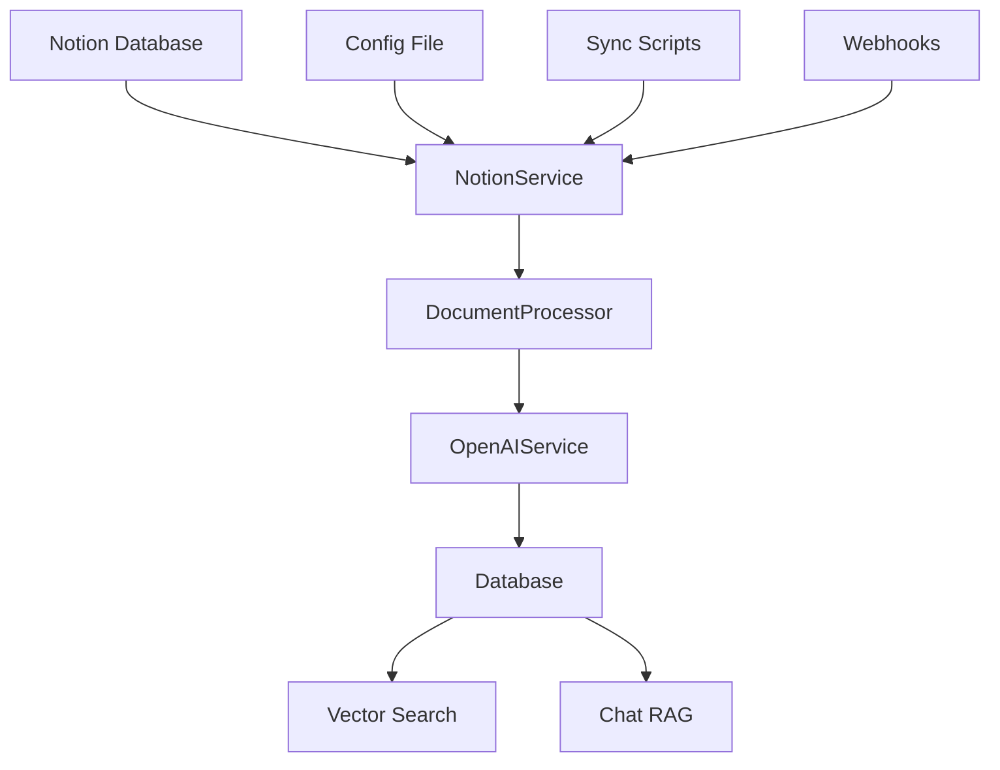

# Data Ingestion Pipeline - How It Works

This document explains the complete data ingestion and update pipeline for Notion Companion, including architecture, configuration, and operational procedures.

## 🏗️ Architecture Overview

The Notion Companion uses a **sophisticated multi-layered data pipeline** that transforms Notion content into a searchable knowledge base with vector embeddings for AI-powered chat and search.



### Core Components

**Service Layer:**
```
┌─ NotionService ──────────────────┐
│ • Fetches pages from Notion API  │
│ • Handles rate limiting          │
│ • Processes Notion blocks        │
└──────────────────────────────────┘
           │
           ▼
┌─ DocumentProcessor ─────────────┐
│ • Intelligent text chunking     │
│ • Metadata extraction          │
│ • Content preprocessing        │
└─────────────────────────────────┘
           │
           ▼
┌─ OpenAIService ────────────────┐
│ • Generates vector embeddings  │
│ • Handles token limits         │
│ • Bilingual support (EN/CN)    │
└─────────────────────────────────┘
           │
           ▼
┌─ Database ─────────────────────┐
│ • Stores documents & chunks    │
│ • Manages vector data          │
│ • Tracks sync timestamps       │
└─────────────────────────────────┘
```

## 🔄 Sync Methods

### 1. Script-Based Sync (Primary)

**Main Entry Points:**
```bash
# Schema sync script
./backend/scripts/sync_databases.py

# Convenience wrapper 
./backend/sync_notion_databases.sh
```

**Usage Examples:**
```bash
# Basic sync
cd backend
.venv/bin/python scripts/sync_databases.py

# Dry run (preview changes)
.venv/bin/python scripts/sync_databases.py --dry-run

# Specific database
.venv/bin/python scripts/sync_databases.py --database-id 1519782c4f4a80dc9deff9768446a113

# Custom config
.venv/bin/python scripts/sync_databases.py --config /path/to/config.toml
```

### 2. Frontend-Triggered Sync

**Via Sidebar Sync Button:**
```typescript
const { syncNotion } = useNotionConnection()
await syncNotion() // Calls /api/notion/sync endpoint
```

### 3. Webhook-Based Updates (Available)

**Real-time updates via Notion webhooks:**
```python
@app.post("/api/notion/webhook")
async def handle_webhook(payload):
    if payload.event == "page.updated":
        await process_single_page(payload.page_id)
```

## ⚙️ Configuration

### Database Configuration (`config/databases.toml`)

```toml
# Database definition
[[databases]]
name = "他山之石"                           # Human-readable name
database_id = "1519782c4f4a80dc9deff9768446a113"  # Notion database ID
description = "其他人的好文章"                 # Description

# Sync behavior
[databases.sync_settings]
batch_size = 10                           # Pages processed per batch
rate_limit_delay = 1.0                    # Seconds between API calls
max_retries = 3                           # Retry failed pages
full_sync = false                         # false = incremental, true = full
chunk_content = true                      # Enable intelligent chunking
generate_embeddings = true                # Generate vector embeddings

# Content processing
[databases.processing]
skip_empty_pages = true                   # Skip pages with minimal content
min_content_length = 50                   # Minimum content length
extract_metadata = true                   # Extract Notion properties
chunk_size = 1000                         # Tokens per chunk
chunk_overlap = 100                       # Overlap between chunks
enable_chunking = true                    # Split long documents

# Filters
[databases.filters]
archived = false                          # Skip archived pages
# Status = "Published"                    # Filter by Notion property

# Rate limiting
[databases.rate_limiting]
requests_per_second = 2                   # API rate limit
batch_size = 10                           # Pages per batch

# Global settings
[global_settings]
concurrent_databases = 3                  # Max databases processed simultaneously
default_batch_size = 10
log_level = "INFO"                        # DEBUG, INFO, WARNING, ERROR

# Embedding configuration
[embedding_settings]
embedding_model = "text-embedding-3-small"
embedding_batch_size = 100
```

### Environment Variables

```bash
# Required
NOTION_ACCESS_TOKEN="your_notion_integration_token"

# Database connection (Supabase)
NEXT_PUBLIC_SUPABASE_URL="your_supabase_url"
NEXT_PUBLIC_SUPABASE_ANON_KEY="your_supabase_key"

# OpenAI for embeddings
OPENAI_API_KEY="your_openai_key"
```

## 📊 Sync Process Flow

### Phase 1: Database Registration
```python
# Register database in our system
database_data = {
    'database_id': config.database_id,
    'database_name': config.name,           # "他山之石"
    'notion_access_token': notion_token,
    'notion_schema': {},
    'field_definitions': {},
    'queryable_fields': {},
    'is_active': True
}
db.upsert_notion_database(database_data)
```

### Phase 2: Page Discovery
```python
# Fetch all pages from Notion database
pages = await notion_service.get_database_pages(config.database_id)

# Apply page limit if specified
if config.page_limit:
    pages = pages[:config.page_limit]

logger.info(f"Found {len(pages)} pages to process")
```

### Phase 3: Content Processing
```python
for page in batch:
    # Check if page exists and needs update
    existing_doc = db.get_document_by_notion_page_id(page_id)
    
    # Compare timestamps for incremental sync
    if not needs_update(page, existing_doc, config.full_sync):
        continue
    
    # Extract content from Notion blocks
    content = await notion_service.get_page_content(page_id)
    title = extract_page_title(page)
    
    # Process the page
    await save_page_to_database(page, content, config)
```

### Phase 4: Document Storage
```python
# Prepare document data
document_data = {
    'notion_page_id': page_id,
    'notion_database_id': config.database_id,
    'title': title,
    'content': content,
    'content_type': 'page',
    'created_time': page.get('created_time'),
    'last_edited_time': page.get('last_edited_time'),
    'page_url': page.get('url'),
    'notion_properties': page.get('properties', {}),
    'extracted_metadata': extract_metadata(page),
    'indexed_at': datetime.utcnow().isoformat()
}

# Generate vector embeddings
if config.generate_embeddings:
    embedding_text = f"{title}\n\n{content}"
    embedding_response = await openai_service.generate_embedding(embedding_text)
    document_data['content_embedding'] = embedding_response.embedding
    document_data['token_count'] = embedding_response.tokens

# Save document
document = db.upsert_document(document_data)
```

### Phase 5: Chunk Processing
```python
# Process into chunks for detailed search
if config.chunk_content and len(content) > 1000:
    # Delete existing chunks
    db.delete_document_chunks(document_id)
    
    # Generate new chunks
    chunks = await document_processor.chunk_document(content, title)
    
    chunks_data = []
    for i, chunk_content in enumerate(chunks):
        chunk_data = {
            'document_id': document_id,
            'content': chunk_content,
            'chunk_order': i,
            'chunk_metadata': {'section': i}
        }
        
        # Generate chunk embedding
        if config.generate_embeddings:
            embedding_response = await openai_service.generate_embedding(chunk_content)
            chunk_data['embedding'] = embedding_response.embedding
        
        chunks_data.append(chunk_data)
    
    # Save chunks
    db.upsert_document_chunks(chunks_data)
```

## 📈 Performance & Monitoring

### Sync Statistics
```bash
# Automatic performance reporting
🎉 Sync completed in 8.9s:
   Databases: 1
   Pages: 3 processed  
   Created: 3
   Updated: 0
   Skipped: 0
   Errors: 0
```

### Comprehensive Logging
```
logs/
├── sync.log          # Detailed sync operations
├── api.log              # API request/response timing  
├── errors.log           # Error tracking
├── performance.log      # Performance metrics
└── app.log              # General application logs
```

### Rate Limiting & Batching
```python
# Process pages in batches
for i in range(0, len(pages), config.batch_size):
    batch = pages[i:i + config.batch_size]
    
    # Process batch
    for page in batch:
        await process_page(page, config)
    
    # Rate limiting between batches
    if i + config.batch_size < len(pages):
        await asyncio.sleep(1.0 / config.requests_per_second)
```

## 🔧 Error Handling & Recovery

### Graceful Degradation
```python
# If embedding fails, document still saved
try:
    embedding_response = await openai_service.generate_embedding(content)
    document_data['content_embedding'] = embedding_response.embedding
except Exception as e:
    logger.warning(f"Failed to generate embedding for {title}: {e}")
    # Document saved without embedding - search still works
```

### Incremental Updates
```python
# Only process modified pages
if existing_doc:
    last_edited = page.get('last_edited_time')
    existing_last_edited = existing_doc.get('last_edited_time')
    
    if last_edited and existing_last_edited:
        if last_edited <= existing_last_edited and not config.full_sync:
            logger.debug(f"Page not modified, skipping: {title}")
            return {'action': 'skipped', 'reason': 'not_modified'}
```

### Retry Logic
```python
# Automatic retries for failed operations
for attempt in range(config.max_retries):
    try:
        result = await process_page(page, config)
        break
    except Exception as e:
        if attempt == config.max_retries - 1:
            logger.error(f"Failed after {config.max_retries} attempts: {e}")
            raise
        await asyncio.sleep(2 ** attempt)  # Exponential backoff
```

## 🌍 Bilingual Support

### Chinese Content Handling
```python
# Bilingual support in schema
CREATE INDEX documents_content_search_idx ON documents 
USING gin(to_tsvector('simple', content));

# 'simple' configuration handles Chinese text properly
# No language-specific stemming or stop words
```

### Embedding Strategy
```python
# OpenAI embeddings work well for mixed EN/CN content
embedding_text = f"{title}\n\n{content}"  # Chinese + English
embedding_response = await openai_service.generate_embedding(embedding_text)

# Results: 1536-dimensional vector supporting semantic search
# across English and Chinese content
```

## 🚀 Automation Options

### Cron Job Setup
```bash
# Daily sync at 2 AM
0 2 * * * /path/to/backend/sync_notion_databases.sh >> /var/log/notion-sync.log 2>&1

# Hourly incremental sync
0 * * * * /path/to/backend/scripts/sync_databases.py --config /path/to/config.toml
```

### CI/CD Integration
```yaml
# GitHub Actions example
name: Sync Notion Content
on:
  schedule:
    - cron: '0 */6 * * *'  # Every 6 hours
  workflow_dispatch:       # Manual trigger

jobs:
  sync:
    runs-on: ubuntu-latest
    steps:
    - uses: actions/checkout@v2
    - name: Setup Python
      uses: actions/setup-python@v2
      with:
        python-version: '3.11'
    - name: Install dependencies
      run: |
        cd backend
        pip install -r requirements.txt
    - name: Sync databases
      env:
        NOTION_ACCESS_TOKEN: ${{ secrets.NOTION_TOKEN }}
        NEXT_PUBLIC_SUPABASE_URL: ${{ secrets.SUPABASE_URL }}
        NEXT_PUBLIC_SUPABASE_ANON_KEY: ${{ secrets.SUPABASE_KEY }}
        OPENAI_API_KEY: ${{ secrets.OPENAI_KEY }}
      run: |
        cd backend
        python scripts/sync_databases.py
```

## 🔍 Troubleshooting

### Common Issues

**1. "Permission denied" errors**
```bash
# Check Notion integration permissions
# Ensure database is shared with integration
# Verify NOTION_ACCESS_TOKEN is correct
```

**2. Rate limit errors**
```toml
# Increase delay in config
[databases.rate_limiting]
requests_per_second = 1  # Slower rate
```

**3. Embedding failures**
```python
# Large documents exceed token limits
# Solution: Automatic chunking handles this
# Documents still saved without embeddings
```

**4. Database connection issues**
```bash
# Test database connectivity
cd backend
.venv/bin/python -c "
import asyncio
from database import init_db, get_db
asyncio.run(init_db())
print('✅ Database connection OK')
"
```

### Debug Mode
```bash
# Enable verbose logging
python scripts/sync_databases.py --verbose

# Or modify config
[global_settings]
log_level = "DEBUG"
```

### Manual Testing
```python
# Test individual components
from services.notion_service import NotionService
service = NotionService("your_token")
pages = await service.get_database_pages("database_id")

# Test database connection  
from database import init_db, get_db
await init_db()
db = get_db()
databases = db.get_notion_databases()
```

## 🎯 Best Practices

### Configuration
- Use environment variables for secrets
- Keep `databases.toml` in version control (without tokens)
- Start with small batch sizes and increase gradually
- Enable incremental sync for production

### Performance
- **Small databases**: `rate_limit_delay = 0.5`
- **Large databases**: `rate_limit_delay = 1.0-2.0`
- **Memory constraints**: Reduce `batch_size` or `concurrent_databases`
- **Long documents**: Enable chunking for better search

### Monitoring
- Check logs regularly for errors
- Monitor sync duration trends
- Set up alerts for failed syncs
- Track embedding generation success rates

### Security
- Never commit API tokens to version control
- Use `.env` files for local development
- Rotate tokens periodically
- Use minimal required Notion permissions

## 📚 Integration with Main Application

After running the sync, content is immediately available:

1. **Search Results**: Documents appear in vector search
2. **Chat RAG**: AI can reference synced content in conversations
3. **Vector Embeddings**: Semantic search ready across English/Chinese
4. **Database Filtering**: Filter chat/search by specific Notion databases
5. **Real-time Updates**: Frontend automatically reflects new content

The pipeline creates a production-ready knowledge base optimized for AI-powered interactions with comprehensive multilingual support.